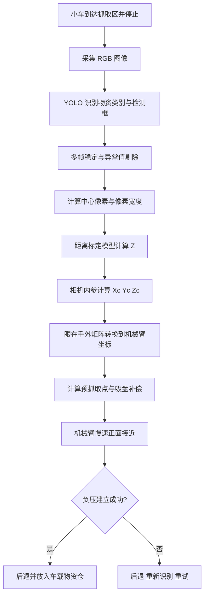

# 无 Tag 物块：YOLO 单目定位与机械臂吸取执行方案

## 1. 项目目标

在不依赖深度图的情况下，使用 Astra Pro Plus 的 RGB 图像完成无 Tag 物块的识别、三维定位和机械臂吸取。

已知条件：

- 相机固定在车身/机械臂旁，属于“眼在手外”；
- 物块实际尺寸为 **30 mm × 30 mm**；
- 物块正面朝向相机，姿态变化较小；
- YOLO 能稳定识别物块，并且检测框基本覆盖完整物块；
- 机械臂末端为真空吸盘，正面吸取；
- ArUco 标定板可用于相机标定和相机—机械臂外参标定。

本方案采用：

> YOLO 检测框中心确定目标方向，检测框像素宽度结合 30 mm 真实尺寸估算距离，再通过眼在手外标定转换成机械臂坐标。

---

## 2. 重要结论与风险

### 2.1 为什么能不用深度图

YOLO 输出物块在图像中的检测框：

```text
(x1, y1, x2, y2)
```

由此得到：

- 中心像素 `(u, v)`：确定目标位于相机哪个方向；
- 像素宽度 `w`：结合真实宽度 30 mm 估算距离 `Z`；
- 相机内参：将 `(u, v, Z)` 转换成相机坐标 `(Xc, Yc, Zc)`；
- 手眼标定矩阵：将相机坐标转换成机械臂基座坐标。

### 2.2 30 mm 小目标的主要风险

30 mm 目标远小于此前按 100 mm 目标估计的尺寸。若物块在图像中只有 20～30 像素宽，YOLO 框仅变化 1 像素，就会造成明显距离误差。

近似关系为：

\[
\frac{\Delta Z}{Z}\approx\frac{\Delta w}{w}
\]

假设检测框宽度误差为 1 像素：

| 物块框宽 | 相对距离误差 | 目标距离 700 mm 时的误差 |
| -------: | -----------: | -----------------------: |
|    20 px |         5.0% |                 约 35 mm |
|    30 px |         3.3% |                 约 23 mm |
|    50 px |         2.0% |                 约 14 mm |
|    70 px |         1.4% |                 约 10 mm |
|   100 px |         1.0% |                  约 7 mm |

因此本方案必须采用：

1. 停车后检测，禁止运动中直接抓取；
2. ROI 裁剪或较高分辨率，尽量让目标宽度达到 50 像素以上；
3. 连续多帧中值滤波；
4. 使用实测数据拟合“检测框宽度—距离”关系；
5. 使用弹性吸盘、慢速接近和负压确认，吸收剩余 Z 误差。

如果目标在实际运行图像中长期小于 25 像素，不建议仅依赖检测框尺寸计算 Z，应缩短相机距离、提高有效分辨率，或恢复深度/测距传感器作为辅助。

---

## 3. 系统总体流程



---

## 4. 坐标与计算原理

### 4.1 YOLO 检测框参数

YOLO 输出：

```python
x1, y1, x2, y2
```

中心像素：

\[
u=\frac{x_1+x_2}{2}
\]

\[
v=\frac{y_1+y_2}{2}
\]

检测框宽高：

\[
w=x_2-x_1
\]

\[
h=y_2-y_1
\]

由于物块底部可能被蓝色支架遮挡，**距离估算优先使用水平方向宽度 `w`**。只有在完整物块高度也能稳定被框住时，才同时使用 `h`。

### 4.2 理论距离公式

物块真实宽度：

\[
L=30\text{ mm}
\]

理论距离：

\[
Z\_{theory}=\frac{f_xL}{w}
\]

其中：

- `fx`：RGB 相机水平方向焦距，单位为像素；
- `w`：YOLO 检测框宽度，单位为像素；
- `L`：物块真实宽度 30 mm；
- `Z`：物块相对 RGB 相机的前向距离，单位与 `L` 一致。

理论公式用于初始化和校验。正式运行优先使用第 7 节建立的实测拟合模型。

### 4.3 由像素坐标计算相机 XYZ

取得稳定距离 `Z` 后：

\[
X_c=\frac{(u-c_x)Z}{f_x}
\]

\[
Y_c=\frac{(v-c_y)Z}{f_y}
\]

\[
Z_c=Z
\]

相机坐标通常约定：

```text
Xc：图像向右
Yc：图像向下
Zc：相机正前方
```

### 4.4 转换成机械臂坐标

眼在手外标定得到：

\[
T\_{base\leftarrow camera}
\]

齐次坐标转换：

\[
\begin{bmatrix}
X*b\\Y_b\\Z_b\\1
\end{bmatrix}
=
T*{base\leftarrow camera}
\begin{bmatrix}
X_c\\Y_c\\Z_c\\1
\end{bmatrix}
\]

转换后的 `(Xb, Yb, Zb)` 才是机械臂控制程序可以使用的目标点。

---

## 5. 硬件准备

### 5.1 必需硬件

- Astra Pro Plus RGB-D 相机；本方案运行时仅使用 RGB 流；
- 机械臂及控制器；
- 真空泵和柔性吸盘；
- 30 mm × 30 mm 实际比赛物块；
- ArUco 或 ChArUco 标定板；
- 钢尺、游标卡尺或激光测距仪；
- 稳固且不可晃动的相机支架。

### 5.2 强烈建议增加

- 真空压力传感器或负压开关；
- 具有轴向压缩量的弹性吸盘座；
- 吸盘接触限位开关，或者机械臂电流/力矩接触检测；
- 相机和机械臂支架定位销，防止拆装后外参变化。

没有负压或接触反馈时，单目距离误差会直接转化为吸取失败，系统可靠性会明显下降。

---

## 6. YOLO 模型和标注要求

### 6.1 一个模型包含全部类别

建议使用一个模型识别全部无 Tag 物资，例如：

```yaml
names:
  0: fire_device
  1: emergency_power
  2: structural_support
  3: gas_purifier
```

### 6.2 标注规则必须统一

所有类别都必须框住同一个物理对象：**完整的 30 mm × 30 mm 物块外边缘**。

禁止出现：

- 某类框整个物块，另一类只框内部图案；
- 有的标注包含蓝色支架，有的不包含；
- 框住图案的三角形、圆形或六边形，而不是物块本体；
- 同一物块在不同图片中的标注松紧差异很大。

如果物块底部被支架遮挡，训练标注应采用一致策略：根据可见的左、右、上边缘，尽量标注完整物块理论边界。需要抽查不同类别的框宽是否存在系统性偏差。

### 6.3 推理分辨率

先在实际停车距离下统计物块在 YOLO 输入图像中的像素宽度：

- `w ≥ 50 px`：可以继续使用本方案；
- `30 px ≤ w < 50 px`：需要 ROI 放大、多帧滤波和实测拟合；
- `w < 30 px`：距离精度风险较高，应调整相机位置或使用两阶段 ROI 推理。

推荐两阶段方式：

1. 在完整图像中找到物资架区域；
2. 从原始高分辨率 RGB 图像裁剪物资架 ROI；
3. 将 ROI 放大到模型输入尺寸再次推理；
4. 把 ROI 坐标映射回原始 RGB 图像坐标。

注意：后续内参计算必须使用与原始 RGB 图像同一坐标系下的 `(u, v, w)`。如果对图像做过缩放或裁剪，必须正确恢复坐标。

---

## 7. 标定工作

整个系统需要完成四项标定：RGB 内参、YOLO 距离模型、眼在手外外参、吸盘偏移。

### 7.1 RGB 相机内参标定

目标：获得：

```text
fx, fy, cx, cy
畸变参数 k1, k2, p1, p2, k3
```

执行步骤：

1. 固定 Astra Pro Plus，使用比赛时相同的 RGB 分辨率；
2. 打印或制作尺寸准确的 ChArUco/ArUco 标定板；
3. 从不同距离、角度和画面位置采集 20～30 张清晰图像；
4. 标定板应覆盖画面中心、四角和边缘；
5. 使用 OpenCV 完成内参和畸变标定；
6. 保存 `camera_matrix` 和 `dist_coeffs`；
7. 检查平均重投影误差，目标建议小于 0.5～0.8 像素；
8. 更改 RGB 分辨率、裁剪方式或数字变焦后，重新确认内参是否适用。

### 7.2 YOLO 检测框—距离标定

这是本方案的核心，不能只使用理论公式。

在比赛实际光照、相机高度和物资架结构下，将同一个 30 mm 物块放置在多个已知距离：

```text
建议覆盖实际工作范围，例如：
350、400、450、500、550、600、650、700 mm
```

若实际停车距离不同，应按真实范围重新布点。RGB 可以在深度相机 0.6 m 深度盲区内工作，但必须确认图像清晰、对焦稳定。

每个距离执行：

1. 小车与相机保持静止；
2. 每个类别分别采集至少 30 帧；
3. 记录真实距离、类别、置信度、`x1/y1/x2/y2`、`w/h`；
4. 对每个距离取检测框宽度中位数；
5. 拟合：

\[
Z=\frac{a}{w}+b
\]

6. 若四个类别存在明显框宽偏差，为每个类别分别保存 `a、b`；
7. 留出部分距离点不参与拟合，用于验证；
8. 记录平均绝对误差、最大误差和标准差。

推荐配置结构：

```yaml
distance_models:
  fire_device:       {a: 0.0, b: 0.0}
  emergency_power:   {a: 0.0, b: 0.0}
  structural_support:{a: 0.0, b: 0.0}
  gas_purifier:      {a: 0.0, b: 0.0}
```

其中数值必须由实测拟合获得，不能直接复制示例。

### 7.3 眼在手外标定

目标：获得固定的：

```text
T_base_camera
```

建议流程：

1. 相机与机械臂底座固定完成后，不再改变相对位置；
2. 将尺寸已知的 ArUco/ChArUco 标定板固定在机械臂末端，或采用机械臂末端对准标定点的方式；
3. 控制机械臂采集 15～25 个不同位置和不同姿态；
4. 每个姿态记录机械臂末端位姿和标定板相对相机位姿；
5. 求解相机坐标系到机械臂基座坐标系的刚体变换；
6. 使用未参与标定的验证点检查转换误差；
7. 将矩阵保存为 YAML/JSON；
8. 相机或机械臂底座发生移动、碰撞、重新安装后必须重新标定。

验收建议：

- 在机械臂可达工作区布置至少 9 个验证点；
- 相机转换后的预测点与机械臂实际触点在 XY 方向误差尽量小于 3～5 mm；
- Z 方向误差尽量小于 5～10 mm；
- 若误差随位置发生规律变化，应检查内参、坐标单位和外参求解，而不是简单增加固定补偿。

### 7.4 吸盘工具中心点与抓取偏移标定

需要确定：

- 机械臂法兰到吸盘接触面的工具偏移；
- YOLO 几何中心到最佳吸取点的固定偏移；
- 吸盘压缩量；
- 预抓取距离和最大接近距离。

建议保存：

```yaml
tool_offset_mm: [0.0, 0.0, 0.0]
target_offset_mm: [0.0, 0.0, 0.0]
pregrasp_distance_mm: 50.0
max_approach_mm: 70.0
suction_compression_mm: 3.0
```

这些值必须根据机械结构和实抓结果填写。

---

## 8. 运行时定位算法

### 8.1 进入检测状态

满足以下条件才允许检测：

- 小车已停止；
- 相机画面稳定；
- 机械臂处于不会遮挡相机的位置；
- 目标处于预设物资架 ROI；
- 自动曝光已经稳定。

停车后建议等待 300～500 ms 再开始收集检测结果。

### 8.2 检测结果筛选

每帧执行：

1. YOLO 推理；
2. 仅保留所需类别；
3. 仅保留物资架 ROI 内检测框；
4. 置信度低于阈值的结果丢弃；
5. 框宽、高、宽高比超出合理范围时丢弃；
6. 多个同类目标时，根据任务槽位或距离画面中心最近原则选择。

建议初始阈值：

```yaml
confidence_min: 0.70
box_width_min_px: 30
box_aspect_ratio_min: 0.75
box_aspect_ratio_max: 1.30
```

阈值需要根据真实测试数据调整。

### 8.3 多帧稳定

建议连续采集 10 帧有效结果：

```text
u_list, v_list, w_list, confidence_list
```

处理：

1. 使用中位数和 MAD/四分位距剔除异常值；
2. 计算 `u、v、w` 的中位数；
3. 中心波动过大或框宽波动过大时重新检测；
4. 禁止使用某一帧的瞬时检测框直接抓取。

建议初始稳定条件：

```yaml
frames_required: 10
center_std_max_px: 2.0
width_cv_max: 0.03
```

### 8.4 计算相机坐标

推荐优先使用实测距离模型：

```python
Z = a / w + b
Xc = (u - cx) * Z / fx
Yc = (v - cy) * Z / fy
```

同时计算理论值作为检查：

```python
Z_theory = fx * 30.0 / w
```

如果 `Z` 与 `Z_theory` 差异远超标定阶段观察到的正常范围，应拒绝此次抓取并重新检测。

### 8.5 坐标转换与抓取点

```python
P_camera = [Xc, Yc, Z, 1.0]
P_base = T_base_camera @ P_camera
P_grasp = P_base + target_offset
```

吸盘姿态在物块始终正面的前提下可使用预先示教的固定姿态。若停车角度变化较大，本方案不能可靠估计物块法向，需要先提高小车对正精度，或增加角点/姿态检测。

---

## 9. 机械臂吸取动作

### 9.1 动作分段

禁止从当前位置直接高速运动到物块表面。采用：

```text
安全位 → 预抓取点 → 慢速接近 → 建立负压 → 沿法向后退 → 物资仓
```

### 9.2 推荐动作流程

1. 根据目标点计算距离物块表面 40～60 mm 的预抓取点；
2. 机械臂以正常速度到达预抓取点；
3. 再次确认目标未丢失，必要时重新定位；
4. 吸盘保持固定正面姿态；
5. 以 5～15 mm/s 的速度沿物块法向接近；
6. 接近预计表面前启动真空泵，或者接触后立即启动；
7. 弹性吸盘压缩约 2～4 mm；
8. 等待 300～500 ms；
9. 检查负压开关；
10. 成功后沿原法向后退 50～80 mm；
11. 移动到车载物资仓；
12. 关闭真空并泄压；
13. 确认物块已经释放。

### 9.3 不使用深度时的接近保护

由于单目 Z 可能存在厘米级误差，至少满足一项：

- 弹性吸盘具有足够轴向行程；
- 负压建立后立即停止前进；
- 接触开关触发后停止前进；
- 使用机械臂电流/力矩阈值判断接触；
- 抓取区域具有机械限位且不会压坏物块。

如果以上反馈全部没有，只能依赖固定距离前馈，比赛可靠性不足，不建议进入最终版本。

---

## 10. 失败处理与重试

### 10.1 视觉失败

出现以下情况时禁止抓取：

- 没有检测到目标；
- 检测置信度过低；
- 多帧中心或框宽不稳定；
- 目标框宽过小；
- 计算距离超出机械臂工作范围；
- 转换后的机械臂坐标超出安全区域。

处理顺序：

1. 等待曝光稳定并重新检测；
2. 调整 ROI 或使用高分辨率裁剪；
3. 小车进行小幅对正；
4. 超过最大次数后跳过并记录失败。

### 10.2 吸取失败

若负压未建立：

1. 立即停止继续压入；
2. 沿法向后退到安全距离；
3. 关闭真空并短暂泄压；
4. 重新采集图像；
5. 在目标中心周围设置小范围补偿点重试；
6. 每个物块最多重试 2～3 次；
7. 连续失败后跳过，避免机械臂或物资架受损。

可采用的重试偏移顺序：

```text
(0, 0) → (+2 mm, 0) → (-2 mm, 0) → (0, +2 mm)
```

偏移范围应小于有效吸取区域。

---

## 12. 核心伪代码

```python
def locate_target(target_class):
    observations = []

    while len(observations) < FRAMES_REQUIRED:
        frame = camera.get_rgb_frame()
        detections = detector.detect(frame)
        target = select_target(detections, target_class, PICKUP_ROI)

        if not valid_detection(target):
            continue

        x1, y1, x2, y2 = target.box
        u = (x1 + x2) / 2.0
        v = (y1 + y2) / 2.0
        w = x2 - x1

        observations.append((u, v, w, target.confidence))

    u, v, w = robust_temporal_median(observations)

    if not stable(observations):
        raise LocalizationError("detection is unstable")

    a, b = distance_model[target_class]
    Z = a / w + b
    Xc = (u - cx) * Z / fx
    Yc = (v - cy) * Z / fy

    P_camera = homogeneous(Xc, Yc, Z)
    P_base = T_base_camera @ P_camera
    P_grasp = apply_target_and_tool_offsets(P_base)

    if not inside_safe_workspace(P_grasp):
        raise LocalizationError("target outside safe workspace")

    return P_grasp


def execute_grasp(target_class):
    for attempt in range(MAX_RETRIES + 1):
        grasp_point = locate_target(target_class)
        grasp_point += retry_offset(attempt)

        arm.move_to(pregrasp_point(grasp_point))
        vacuum.on()
        arm.approach_slowly(grasp_point, stop_on_contact=True)

        if vacuum.wait_until_ok(timeout=0.5):
            arm.retreat_along_normal()
            arm.move_to(storage_pose(target_class))
            vacuum.release()
            return True

        arm.stop()
        arm.retreat_along_normal()
        vacuum.release()

    return False
```

---

## 13. 开发实施顺序

### 阶段 1：确认视觉条件

- [ ] 固定相机和物资架相对姿态；
- [ ] 确认实际物块为 30 mm × 30 mm；
- [ ] 统计比赛停车距离下目标框的实际像素宽度；
- [ ] 确认四种类别标注都对应完整物块；
- [ ] 确认 RGB 图像无严重模糊、过曝和失焦；
- [ ] 选择是否启用两阶段 ROI 推理。

### 阶段 2：完成标定

- [ ] RGB 内参标定；
- [ ] 畸变校正验证；
- [ ] 采集检测框宽度—实际距离数据；
- [ ] 拟合每类距离模型；
- [ ] 眼在手外标定；
- [ ] 吸盘 TCP 与目标偏移标定。

### 阶段 3：仅定位、不抓取

- [ ] 屏幕显示类别、检测框、中心和像素宽度；
- [ ] 输出估算的相机 XYZ；
- [ ] 输出转换后的机械臂 XYZ；
- [ ] 用直尺/标定点验证 XYZ；
- [ ] 保存每次定位图像和日志；
- [ ] 确认不同类别和不同槽位误差没有明显偏置。

### 阶段 4：静态单物块抓取

- [ ] 机械臂先只运动到预抓取点；
- [ ] 人工确认方向正确后才允许接近；
- [ ] 低速完成第一次接触；
- [ ] 验证负压判断；
- [ ] 每种物资至少完成 30 次抓取测试；
- [ ] 根据失败分布调整偏移和接近量。

### 阶段 5：完整比赛流程

- [ ] 小车自主停车；
- [ ] 机械臂退出相机视野；
- [ ] 自动识别任务所需物资；
- [ ] 自动定位、抓取、验证和入仓；
- [ ] 测试光照变化、小车偏角和停车距离变化；
- [ ] 测试连续抓取多个物块；
- [ ] 测试检测失败和吸取失败的恢复逻辑。

---

## 14. 测试与验收指标

### 14.1 视觉定位

- 每个类别、每个槽位至少采集 50 组静态数据；
- 类别识别正确率建议达到 99% 以上；
- 停车后连续检测丢失率小于 2%；
- 多帧中心标准差建议小于 2 像素；
- 多帧框宽变异系数建议小于 3%；
- 实际工作距离内 Z 平均绝对误差目标小于 10～15 mm；
- 转换到机械臂基座后的 XY 误差目标小于 3～5 mm。

### 14.2 抓取

- 单类连续抓取 30 次，成功率不低于 95%；
- 四类混合、随机槽位抓取 50 次，成功率不低于 90%～95%；
- 不允许因 Z 估算偏差碰倒物资架；
- 吸取失败后能够安全后退并重试；
- 任何超出工作空间的坐标不得下发给机械臂。

如果 Z 误差无法稳定控制在吸盘允许范围内，应保留本方案用于 XY 定位，把 Z 改为固定物资架平面、接触检测或深度测距，不应继续通过增加固定补偿掩盖系统误差。

---

## 15. 调试日志要求

每次抓取至少保存：

```text
时间戳
目标类别
YOLO置信度
x1, y1, x2, y2
u, v, w, h
连续帧统计值
估算相机XYZ
转换后机械臂XYZ
预抓取点与最终接近量
负压是否成功
重试次数
最终抓取结果
对应RGB图片
```

日志用于区分以下问题：

- YOLO框不稳定；
- 单目距离模型不准；
- 手眼标定误差；
- 吸盘工具偏移错误；
- 机械臂重复定位误差；
- 小车停车姿态变化；
- 真空系统或物块表面问题。

---

## 16. 最终推荐配置

```yaml
target_size_mm: 30.0
use_depth: false
distance_source: yolo_bbox_calibration
distance_axis: width
frames_required: 10
confidence_min: 0.70
box_width_min_px: 30
center_std_max_px: 2.0
width_cv_max: 0.03
pregrasp_distance_mm: 50.0
approach_speed_mm_s: 10.0
vacuum_wait_ms: 500
max_retries: 2
```

最终运行方案：

> YOLO 框住完整 30 mm 物块 → 多帧稳定中心与框宽 → 实测距离模型计算 Z → 相机内参计算 XYZ → ArUco 眼在手外矩阵转换 → 固定姿态预抓取 → 慢速接近 → 负压确认 → 后退入仓。

该方案开发量较小，适合物块正对、尺寸固定、YOLO框稳定的比赛场景。但由于目标仅 30 mm，必须用实测拟合和接触/负压反馈解决检测框像素误差带来的 Z 偏差。
